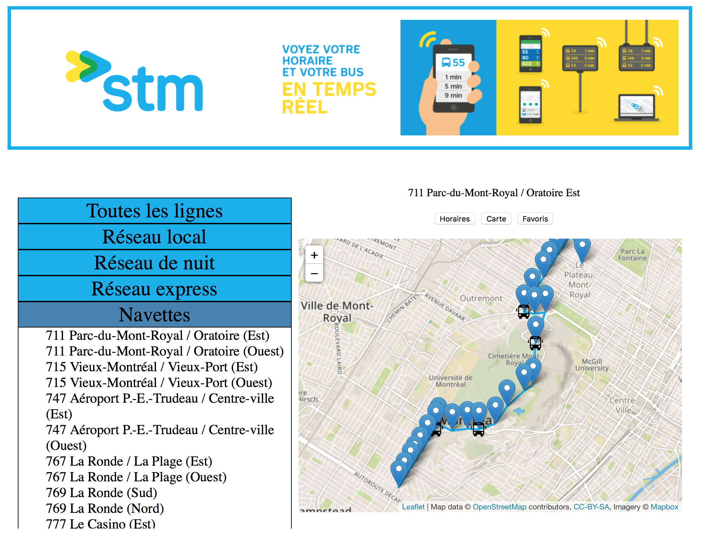
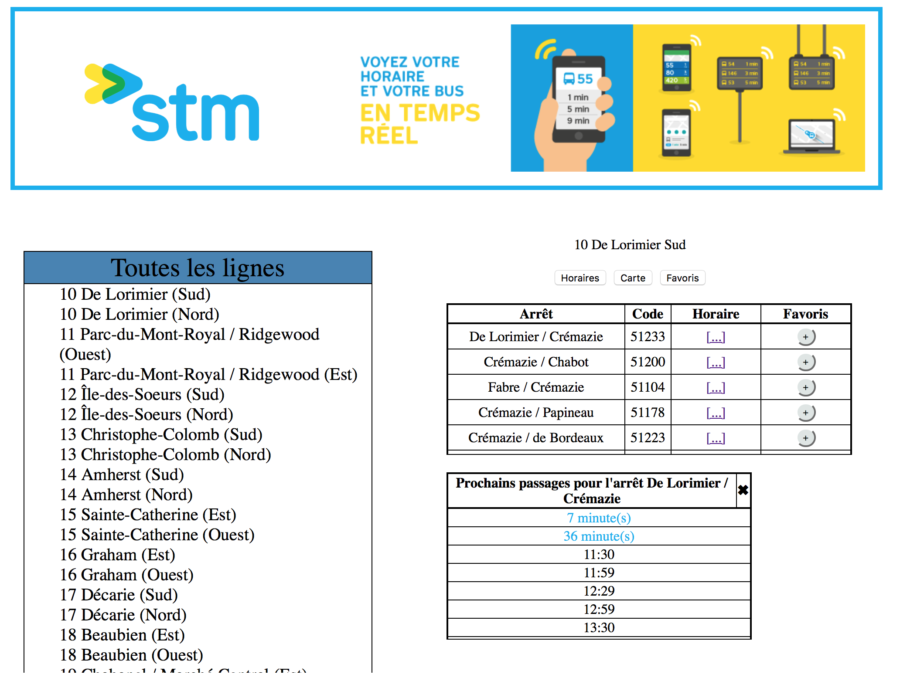
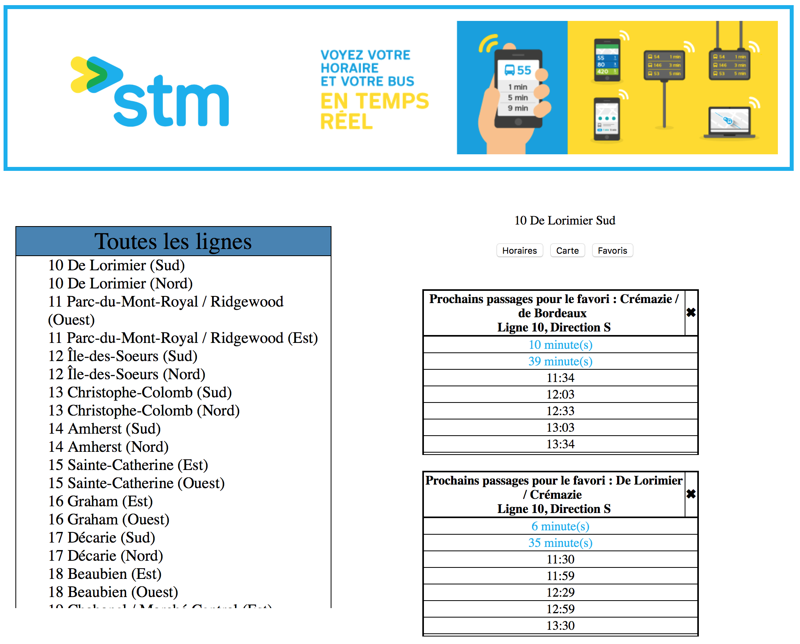

# STMWebApp

## Présentation

Conception d'un site web permettant d'afficher les horaires des bus de la STM (Société de transport de Montréal) en temps réel.

L'objectif du site est de permettre aux utilisateurs de consulter rapidement l'ensemble des lignes de bus, classées par catégories. En sélectionnant une ligne, l'utilisateur obtient la liste des arrêts de bus (sous forme de tableau). En sélectionnant un arrêt donné, l'utilisateur accède à la liste des passages pour le reste de la journée.
D'autres fonctionnalités viennent compléter l'offre de service, telles que la possibilité d'ajouter des lignes en "favoris" afin de voir les horaires de manière simplifiée pour les lignes qui sont d'intérêt pour l'usager, une vue des trajets sous forme cartographique, et un "back-end" proposant une API REST avec mise en cache des données.

### Logiciels utilisés

- WebStorm et IntelliJ IDEA
- MongoDB Compass

## Fonctionnalités

### Page d'accueil

- Menu déroulant présentant l'ensemble des lignes de bus classées par catégories. Lorsque l'usager séléctionne une ligne, celle-ci est tracée sur la carte.

### Page horaires

- Lorsque l'usager clique sur le bouton horaire, un tableau des arrêts de la ligne précédemment sélectionnée s'affiche. L'usager peut alors choisir un arrêt et consulter l'horaire des 10 prochains passages prévus pour cet arrêt compte tenu de l'heure actuelle. Il peut également ajouter l'arrêt à ses favoris.

### Page favoris

- Lorsque l'usager clique sur le bouton favoris, il peut consulter les horaires de ses arrêts favoris (limitation de 10 favoris). Il peut également supprimer un arrêt de ses favoris.

